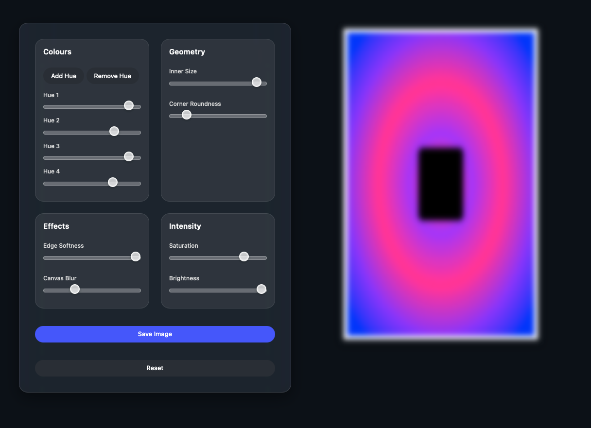

# WallPaperArt 🎨✨

A vibe-coded generative art playground built with WebGL, shaders, and pure creative energy.  
Coded in a few hours on `o4-mini-high` — inspired by the stunning visuals of @nickthomm.

## What's Inside
- Real-time generative visuals using `three.js` & GLSL shaders
- Fully customizable via sliders
- Clean vertical layout for art-first focus
- Instant 4K vertical export for wallpapers

## 🛠 Tech Stack
- `three.js`
- WebGL fragment shaders
- Vanilla JS + HTML/CSS

## 🚀 Getting Started
Clone the repo and open `index.html` in your browser:
```bash
git clone https://github.com/Neel-Sh/WallPaperArt.git
cd WallPaperArt
open index.html
```

## 📸 Screenshot


## 🤍 Credits 
- Coded by [@Neel-Sh](https://github.com/Neel-Sh)

## 🔮 Vibe Coding Is the Future
No plan. No stress. Just sliders, colors, and vibes.  
Feel free to fork it, remix it, and make it yours.
